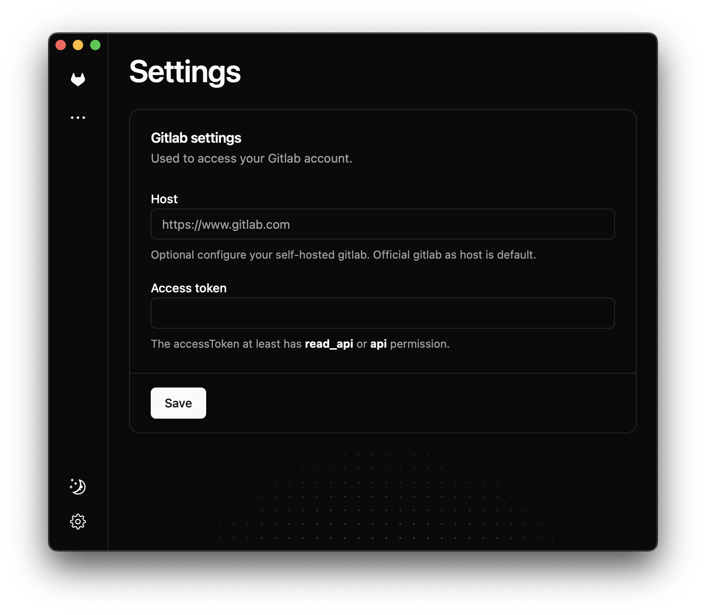
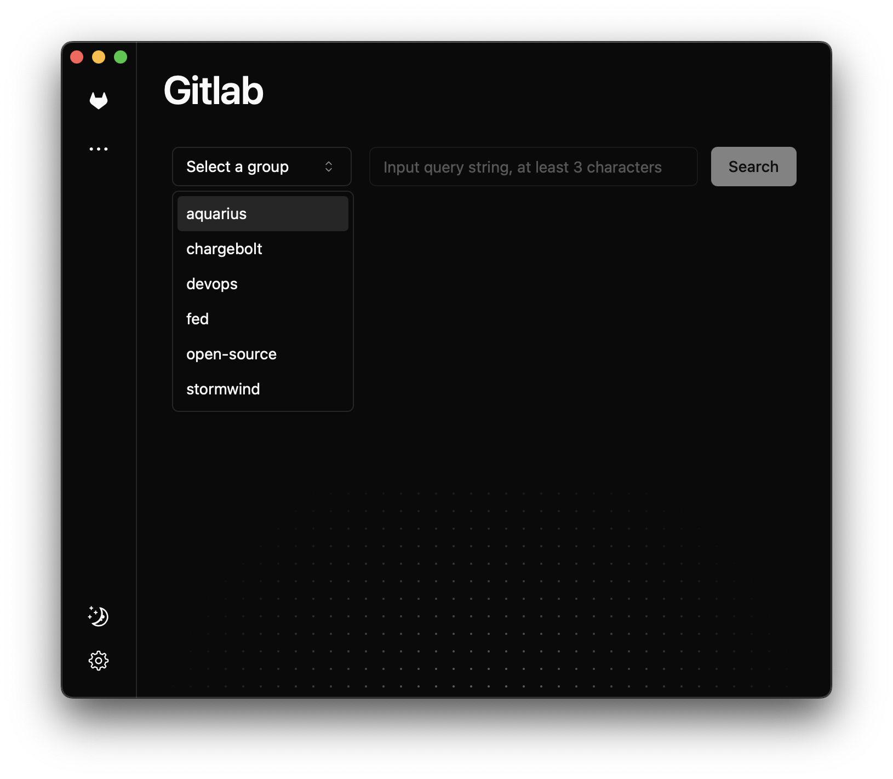
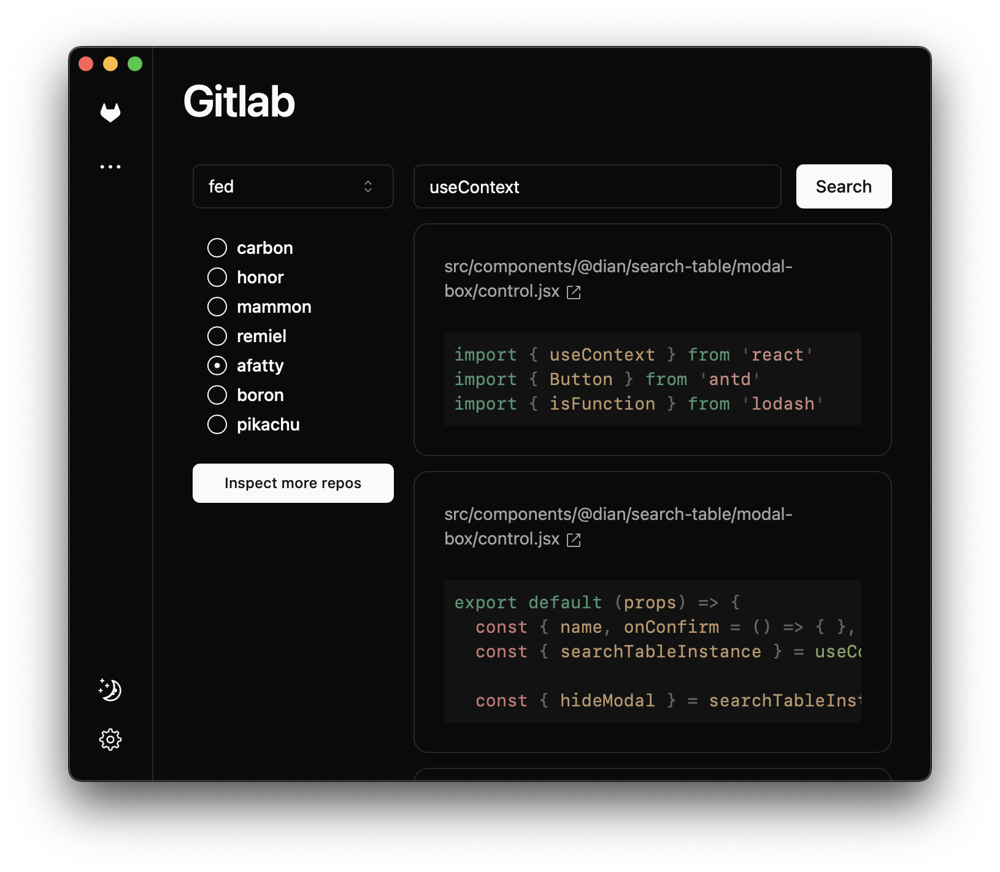

# Batman

## Introduction

To provide the capability of global search code snippets for GitLab Community Edition which does not
support global search natively.

为不支持全局搜索的 gitlab 社区版提供全局搜索代码片段的能力

## Usage

1. Configure your GitLab token and host.



2. Choose a group



3. Input your search keyword



## Roadmap

- [ ] Release through Github actions
- [ ] Auto Updater
- [ ] Auto inspect more repos
- [ ] Search in repository

## Development

### Add Component

```bash
pnpm dlx shadcn-ui@latest add button
```
